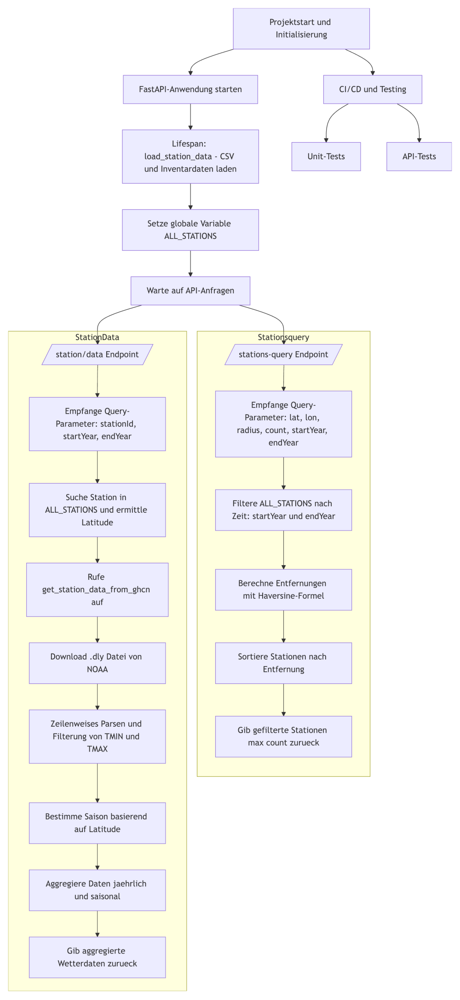

# Überblick über das Backend von ClimateLens

Das **Backend** von **Climate Lens** ist wie folgt aufgebaut:

Das Projekt verwendet Docker zur Containerisierung und Python in Kombination mit FastAPI für die Backend-Anwendung.

Es wird ein [Dockerfile](../Dockerfile) verwendet, um die Anwendung auf Basis eines Python 3.10-Images zu erstellen. Abhängigkeiten werden über [requirements.txt](../requirements.txt) installiert, und die Anwendung wird mit Uvicorn gestartet. Eine [docker-compose.yml](../docker-compose.yml) Datei definiert die Services für Backend und Frontend sowie deren Ressourcenzuteilung und Netzwerkports. Für die Versionskontrolle wird eine Git-Repository-Struktur genutzt, und eine [GitHub Actions-Pipeline](../.github/workflows/docker-image.yml) sorgt für automatisierte Unit- und API-Tests, den Build des Docker-Images und die Überprüfung des Containerbetriebs.

Die Anwendung basiert auf FastAPI und wird über eine Lifespan-Funktion initialisiert, die beim Start eine Liste von Wetterstationen lädt und in einer globalen Variable speichert. Zudem wird die CORSMiddleware verwendet, um Zugriffe von verschiedenen Ursprüngen zu erlauben und den Betrieb mit dem Frontend zu ermöglichen.

Zur Unterstützung dieser Funktionalitäten lädt die Anwendung [Stationsdaten](../src/load_station_data.py) und [Inventardaten](../src/load_station_inventory.py) von NOAA und nutzt Hilfsfunktionen, um Entfernungen zwischen den Stationen und einem Referenzpunkt zu berechnen sowie die Wetterdaten zu aggregieren. Diese Daten werden dann nach Jahren und Saisonen strukturiert zurückgegeben.

Es gibt zwei wesentliche API-Endpunkte: Der Endpunkt [/stations-query](../src/fetch_stations_query.py) liefert eine Liste von Wetterstationen, die innerhalb eines angegebenen geografischen Radius liegen, unter Berücksichtigung von optionalen Zeitfiltern. Der Endpunkt [/station/data](../src/get_station_data.py) stellt aggregierte Wetterdaten für eine spezifische Station bereit, wobei Daten aus einer NOAA-Quelle heruntergeladen und saisonal sowie jährlich aggregiert werden.

Die Qualität des Projekts wird durch Unit- und API-Tests gesichert. [Unit-Tests](../src/test_back_end.py) prüfen die interne Funktionalität, etwa bei der Filterung von Stationsdaten oder der Berechnung von Entfernungen, während [API-Tests](../src/test_api_backend.py) sicherstellen, dass die Endpunkte die richtigen Statuscodes und Daten zurückliefern, auch bei ungültigen Eingaben.

Folgend ist eine detaillierte Darstellung, in Form eines Ablaufdiagramms, zu sehen, die den Programmablauf und die einzelnen Komponenten des Projekts zusammenfasst:

