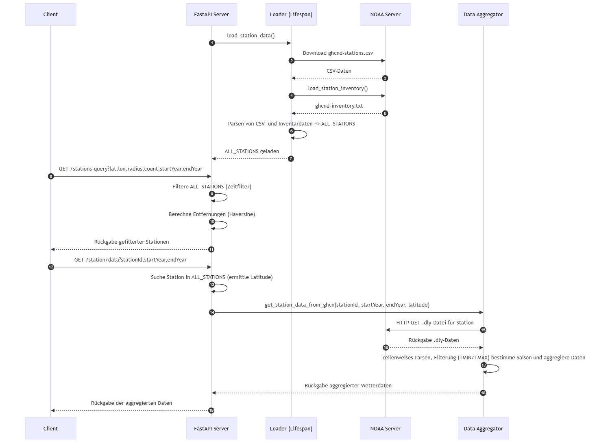

# Sequenzdiagramm

Die Anwendung verarbeitet umfangreiche Klimadaten aus dem Global Historical Climatology Network (GHCN), bereitgestellt von der National Oceanic and Atmospheric Administration (NOAA) unter https://www1.ncdc.noaa.gov/pub/data/ghcn/daily/. Beim Start der Anwendung lädt der FastAPI-Server über die Funktion [load_station_data()](../src/load_station_data.py) zunächst die zentralen Metadaten der Wetterstationen: Die Datei „ghcnd-stations.csv“ liefert grundlegende Informationen wie Stations-IDs, geografische Koordinaten, Höhenangaben und weitere Details zu den einzelnen Stationen. Ergänzend dazu wird die Datei „ghcnd-inventory.txt“ abgerufen, in der für jede Station dokumentiert ist, welche Messgrößen (beispielsweise tägliche Minimal- und Maximaltemperaturen) verfügbar sind. Beide Datensätze werden geparst und in einem konsolidierten Modell, bezeichnet als ALL_STATIONS, zusammengeführt, das als Basis für weitere Abfragen dient.

Wird eine Anfrage an den Endpunkt [/stations-query](../main.py) gestellt – mit Parametern wie geografischer Breite, Länge, Radius, Anzahl sowie einem definierten Zeitraum – filtert der Server die ALL_STATIONS-Daten nach dem Zeitfilter und berechnet mithilfe der Haversine-Formel die Entfernungen, um so eine gefilterte Liste der Stationen zurückzugeben. Bei einer Anfrage an [/station/data](../main.py) wird anhand der Stations-ID zunächst die entsprechende Station in ALL_STATIONS gesucht, um die benötigte Latitude zu ermitteln. Anschließend lädt die Anwendung on-demand die entsprechenden .dly-Dateien vom NOAA-Server. Diese Dateien enthalten die täglichen Messwerte über längere Zeiträume. Der Data Aggregator parst diese Dateien zeilenweise, filtert die relevanten Daten (z.B. TMIN und TMAX), bestimmt die zugehörigen Saisons und aggregiert die Ergebnisse, bevor sie an den Client zurückgesendet werden.

Detaillierte Informationen zu den Datenformaten, Elementdefinitionen und Stationsvariablen sind in der [offiziellen Dokumentation von NOAA](https://www.ncei.noaa.gov/data/global-historical-climatology-network-daily/doc/GHCND_documentation.pdf) zu finden.

